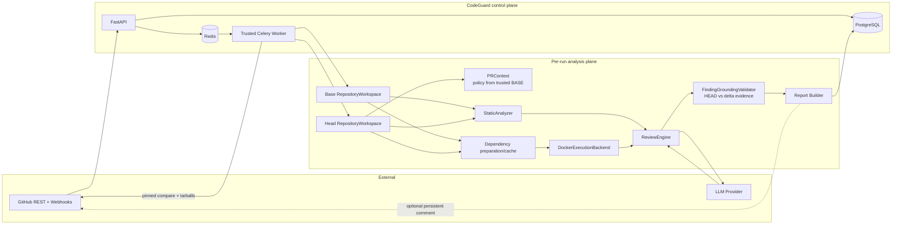
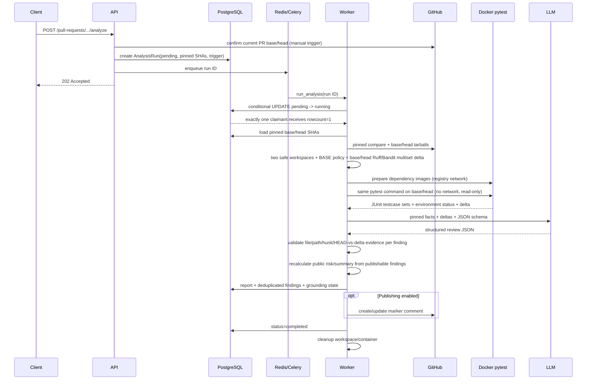
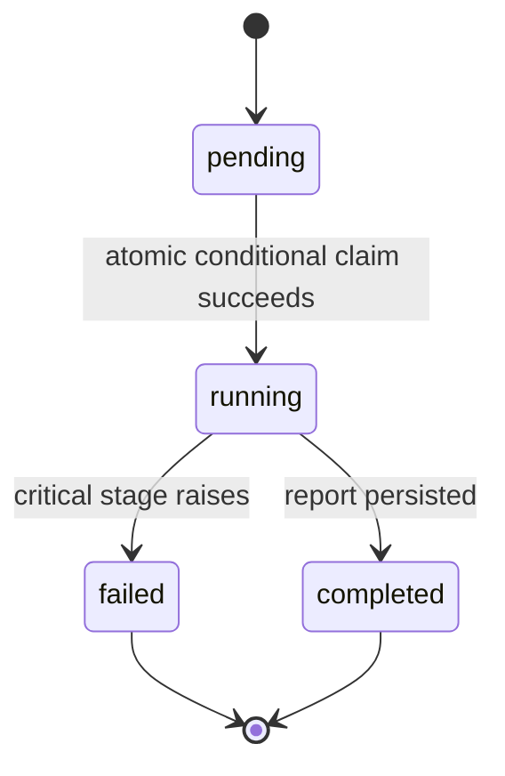

# CodeGuard V1.1.1 Correctness Hardening Architecture

## System view



## Analysis sequence



## State and failure model



Static tools and the local test backend are evidence producers: unavailable/failed evidence is recorded and review continues. A grounding failure is isolated to one finding. Pinned GitHub comparison/context construction, workspace creation, structured LLM parsing, and report persistence are critical stages. Any critical exception records `failed_stage`, a redacted bounded `error_summary`, and `finished_at`.

Only `pending` is claimable. The database conditional update and affected-row count prevent duplicate workers from reaching Docker, LLM, TestExecution, or ReviewReport work. `failed` and `completed` are terminal; an explicit retry creates a new AnalysisRun and preserves the prior audit trail.

## Module responsibilities

| Module | Responsibility |
| --- | --- |
| `main.py`, `schemas.py` | FastAPI compatibility APIs, report/history APIs, signed webhook boundary |
| `services.py`, `db_models.py`, `database.py` | Atomic run claim, transactions, ORM schema, report/finding persistence and delivery deduplication |
| `github_client.py` | GitHub REST fetch/pagination and marker-based summary publishing |
| `workspace.py`, `repo_manager.py` | Snapshot metadata, safe extraction, bounded path access and cleanup |
| `context/` | Typed changed files/PR context, repo instructions and hunk-aware compression |
| `analysis/static_analyzer.py`, `analysis/models.py` | Base/head Ruff/Bandit execution, duplicate-aware fingerprint multisets and existing/resolved/introduced deltas |
| `analysis/grounding.py` | Repository-relative path, diff-hunk, HEAD evidence and static/test delta attribution validation |
| `execution/environment.py` | Dependency manifest detection, fingerprinting and Python-version cache keys |
| `execution/` | JUnit testcase comparison, environment/code failure separation, network-separated preparation and constrained local Docker tests |
| `llm/` | Provider interface, provider HTTP adapters, prompt contract and report schemas |
| `analysis/review_engine.py` | Evidence prompt construction, structured response parsing, grounding and verified public report recalculation |
| `analysis/report_builder.py` | Finding fingerprints and persistent Markdown summary |
| `analysis/pipeline.py`, `tasks.py` | Stage orchestration, status transitions, timing, cleanup and Celery entrypoints |
| `evaluation/` | JSONL datasets, metrics, benchmark, ablations and future adapter contract |
| `security/redaction.py` | Central bounded credential/query/database/process-secret sanitization |
| `demo.py` | Offline deterministic end-to-end V1.1.1 smoke flow |

## Data model

```mermaid
erDiagram
    PULL_REQUESTS ||--o{ ANALYSIS_RUNS : has
    ANALYSIS_RUNS ||--o{ TEST_EXECUTIONS : records
    ANALYSIS_RUNS ||--o| REVIEW_REPORTS : produces
    REVIEW_REPORTS ||--o{ REVIEW_FINDINGS : contains

    PULL_REQUESTS {
        int id PK
        string repository
        int pr_number
        string analysis_status
    }
    ANALYSIS_RUNS {
        int id PK
        int pull_request_id FK
        string status
        string failed_stage
        text error_summary
        string base_sha
        string head_sha
        string trigger_source
        int webhook_delivery_id FK
    }
    TEST_EXECUTIONS {
        int id PK
        int analysis_run_id FK
        string status
        int exit_code
        bool timed_out
        int duration_ms
        string backend
        string revision_role
        string commit_sha
        json passed_tests
        json failed_tests
        json error_tests
        json skipped_tests
    }
    REVIEW_REPORTS {
        int id PK
        int analysis_run_id FK_UK
        string risk_level
        string raw_model_risk
        text raw_model_summary
        string model
        json test_summary
        json static_summary
    }
    REVIEW_FINDINGS {
        int id PK
        int review_report_id FK
        string severity
        string file_path
        int line_start
        string fingerprint
        string grounding_status
        text grounding_notes
    }
```

`WEBHOOK_DELIVERIES` is independent operational state keyed by GitHub’s unique delivery ID.

## Evidence and trust boundaries

The GitHub snapshots and their code are untrusted. Archive entries are validated before extraction. Repository policy (`AGENTS.md`/`CODEGUARD.md`) is loaded only from the trusted pinned BASE revision; a HEAD edit remains diff evidence and cannot change the current review policy. Static tools inspect files without a shell. Dependency preparation uses only CodeGuard's generated Dockerfile and detected manifest content; the repository Dockerfile is ignored. Preparation may contact package registries and execute third-party package build logic, so it is a separate trust boundary. Repository code is never installed on the host.

Tests use the prepared image but run with networking disabled, a read-only repository volume, dropped capabilities, `no-new-privileges`, PID/memory/time limits and forced cleanup. Both revisions use the same pytest/JUnit command. Dependency installation, collection, timeout, and execution failures are environment evidence and never populate introduced test regressions. The LLM receives only the bounded normalized PR context and recorded deltas. Its output remains untrusted after Pydantic validation until deterministic grounding classifies every finding and public risk/summary are recalculated from grounded/partial findings.

All external/persistence/logging exception boundaries sanitize authorization headers, common provider/GitHub tokens, secret query parameters, database credentials, and known process secrets. Logging carries run/repository/PR/base/head/stage fields but never intentionally carries prompts or environment dumps.

The Celery worker is trusted because it owns the Docker socket. Test containers never receive that socket. Local Docker is intentionally documented as a development execution backend, not a production multi-tenant boundary.

## Compatibility boundary

The original top-level APIs and task names remain. `context.pr_context` and `test_runner.run_pytest` are compatibility wrappers around the V1 packages. The V1.1.1 schema revision is additive and preserves the earlier migration history.

## Current limitations

- Execution is Python-first and provides basic dependency-aware Python execution for root `requirements.txt` and standard root PEP 621 dependencies only.
- The evaluation tooling is a Review Engine Evaluation Harness. Its synthetic fixture is a smoke test; real labelled datasets remain future validation work.
- For complex diverged branches, V1.1.1 verifies the pinned base-tip and head revisions; merge-result verification is not yet modeled.
