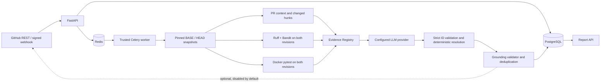

# CodeGuard v1.2.0 architecture

CodeGuard is an evidence-grounded GitHub PR verification platform. The API and queue coordinate work; deterministic analyzers establish facts; the LLM proposes explanations by selecting existing evidence IDs; a resolver constructs authoritative report metadata.

## Components and data flow



FastAPI stores the PR and analysis request; PostgreSQL holds pinned commit SHAs, run state, test executions, full evidence registry, and final findings. Redis brokers Celery jobs. The worker owns the GitHub and Docker connections. A target repository's test container does not receive the Docker socket.

## Analysis sequence

```mermaid
sequenceDiagram
    participant Client
    participant API as FastAPI
    participant DB as PostgreSQL
    participant Q as Redis/Celery
    participant W as Worker
    participant GH as GitHub
    participant D as Docker pytest
    participant L as LLM

    Client->>API: POST /pull-requests/.../analyze
    API->>GH: confirm PR and pin BASE/HEAD SHAs
    API->>DB: create pending run with pinned SHAs
    API->>Q: enqueue run ID
    API-->>Client: 202 Accepted
    Q->>W: claim pending run atomically
    W->>GH: fetch pinned compare and source archives
    W->>W: safe workspaces; PR context; Ruff/Bandit BASE and HEAD
    W->>D: same pytest command on BASE and HEAD
    D-->>W: JUnit outcomes and execution status
    W->>W: classify deltas and build Evidence Registry
    W->>L: facts, registry, and strict proposal schema
    L-->>W: findings selecting evidence_ids only
    W->>W: validate IDs; resolve file/line/rule/test facts
    W->>W: existing grounding validation and safe deduplication
    W->>DB: report, registry, resolved findings, audit state
    DB-->>Client: report through API
```

The worker fetches pinned compare data and separate BASE/HEAD archives; it does not silently switch to a newer PR head. Repository policy files are loaded from the trusted BASE revision. HEAD policy edits are ordinary diff content and do not control the current review. Diff compression keeps complete file/hunk units inside a bounded prompt.

## Evidence Registry and grounding

The registry is built from deterministic inputs: changed diff hunks, HEAD static findings with BASE/HEAD classification, confirmed BASE-pass-to-HEAD-fail tests, and other observed HEAD test failures. Entries have per-analysis IDs such as `E001`. They retain type, source/tool, classification, rule and severity when supplied, file and line range when supported, test name, BASE/HEAD results, related changed hunk, and message.

The model's proposal schema contains `title`, `description`, `severity`, `category`, and `evidence_ids`. It does **not** contain authoritative file, line, rule, or evidence-citation fields. An unknown ID fails grounding. CodeGuard resolves selected IDs back to registry entries and then applies the existing path, hunk, static-delta, and test-delta validator. Its final file/line and evidence metadata come from deterministic entries, not model prose.

For regressions, a BASE PASS → HEAD FAIL testcase is evidence by itself. A conservative Python AST check associates a direct test import/call with a unique changed function hunk. Ambiguous or unsupported associations remain test-level evidence without an invented source line; the test file is not automatically used as a source finding location. Multiple test IDs may support one finding. Obvious duplicates are merged only when the same uniquely linked changed hunk and category establish a common source; uncertain causes remain separate.

The prompt-visible registry is persisted even for clean reports. Public risk and summary are recalculated from publishable findings; rejected or partially grounded proposals remain auditable. A large registry that exceeds the configured prompt budget fails closed rather than silently dropping evidence IDs.

## Execution and trust boundaries

- GitHub archive extraction rejects absolute paths, traversal, links, and special files. Workspace file access stays inside the extracted root.
- Static tools use argument lists without a shell. Both revisions are scanned, and duplicate-aware deltas distinguish existing, resolved, and introduced findings.
- Dependency preparation builds CodeGuard's generated image from a supported manifest. Registry network access is allowed only at this separate preparation boundary; the target repository Dockerfile is not run.
- BASE and HEAD use the same pytest/JUnit command. The test phase uses a read-only repository mount, no network, resource limits, dropped capabilities, `no-new-privileges`, and forced cleanup. Installation/collection/timeout/environment failures do not become confirmed code regressions.
- The trusted worker controls the Docker socket. This is a local/development execution model, **not** production multi-tenant isolation.
- Prompt redaction filters known secret patterns before provider transmission. Repository workspace creation rejects common credential files. Neither control proves that every possible secret format is caught.
- Provider failures remain failures; no real-provider request silently falls back to `fake`. GitHub comment publishing is opt-in and disabled by default.

## State, persistence, and failure behavior

A run moves from `pending` to `running` only through an atomic database claim; only one worker proceeds. It then becomes `completed` or `failed`, both terminal. A new request creates a new run and retains prior audit history. Critical failures in pinned GitHub context, workspace creation, structured response parsing, or persistence mark the run failed with a bounded, redacted stage/error summary. Unavailable static/test evidence is recorded rather than mislabelled as a code regression. One invalid model finding does not erase other grounded findings.

Alembic owns production schema changes. The additive v1.2.0 migrations persist selected evidence IDs, resolved finding metadata, and the complete report-level registry; previous migration history and the `v1.1.1` tag remain unchanged.

| Area | Main modules |
| --- | --- |
| API and webhook | `main.py`, `schemas.py`, `github_webhook.py` |
| State and persistence | `services.py`, `db_models.py`, `database.py`, `alembic/` |
| GitHub and workspaces | `github_client.py`, `repo_manager.py`, `workspace.py` |
| Context and deterministic analysis | `context/`, `analysis/static_analyzer.py`, `execution/` |
| Registry and grounded review | `analysis/evidence_registry.py`, `analysis/evidence_resolution.py`, `analysis/grounding.py`, `llm/` |
| Queue and orchestration | `celery_app.py`, `tasks.py`, `analysis/pipeline.py` |
| Evaluation and validation | `evaluation/`, `tests/`, `docs/REAL_WORLD_VALIDATION.md` |

## Current limits

CodeGuard is Python-first and recognizes root `requirements.txt` or standard root PEP 621 dependencies. It verifies pinned base-tip and head revisions, not a synthesized merge result. The real-world validation currently covers two controlled PRs; the local 7B model's behavior cannot be generalized from them. The separate evaluation harness has synthetic fixtures but no statistical real-world benchmark.
