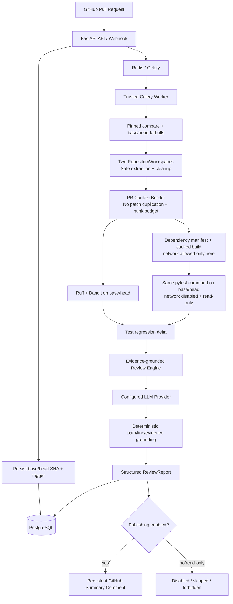

# CodeGuard

CodeGuard V1.1.1 is an AI-powered GitHub Pull Request verification platform. It pins every analysis to immutable base/head commits, compares both revisions, grounds model findings deterministically, and combines trusted-base repository instructions, static-analysis deltas, testcase-level test deltas, and a structured LLM review. Its purpose is evidence-backed verification—not an autonomous patch generator and not a thin “diff to prompt to comment” wrapper.

## Architecture



The complete component and trust-boundary design is in [ARCHITECTURE.md](ARCHITECTURE.md).

## Request-to-report flow

1. `GET /pull-requests/{owner}/{repo}/{number}` fetches and stores current GitHub metadata.
2. `POST /pull-requests/{owner}/{repo}/{number}/analyze` confirms the current PR with GitHub, persists its base/head SHAs and `manual_api` trigger, creates a `pending` AnalysisRun, and returns HTTP 202. Webhooks pin the SHAs carried by the signed payload and link the delivery row.
3. Celery reads only those stored SHAs. It uses GitHub's compare endpoint for the pinned file/diff context and downloads separate base/head tarballs; it never chooses a newer PR head.
4. Two `RepositoryWorkspace` instances validate every tar member, discover GitHub's top-level directory, and guarantee cleanup.
5. The context layer reads `AGENTS.md`/`CODEGUARD.md` only from the trusted BASE revision, compresses by complete file/hunk units, and serializes changed-file metadata without re-inserting each raw `patch`. HEAD policy-file edits remain ordinary reviewable diff content.
6. Ruff/Bandit run on both revisions. Stable, duplicate-aware multiset matching classifies findings as existing, resolved, or introduced without treating line movement alone as a new issue.
7. A dependency manifest is detected from `requirements.txt` or standard `[project].dependencies`. CodeGuard builds a generated, fingerprint-cached dependency image with package-registry network access; it never trusts the repository Dockerfile or installs packages on the host.
8. The same pytest command writes JUnit XML on base and head with networking disabled, a read-only repository mount, memory/PID/timeout limits, capability drop, and explicit preparation/collection/test statuses. Passed, failed, error, and skipped testcase identifiers produce simultaneous existing/resolved/introduced sets. Only a testcase recorded as passing on BASE and failing on HEAD is called a confirmed regression; environment failures instead make verification unavailable.
9. The review prompt separates observed `FACTS` from `INSTRUCTIONS`; it may call an issue introduced only when a delta proves that claim.
10. `FindingGroundingValidator` normalizes repository paths, validates line ranges and diff identifiers against known files/hunks, and verifies static/test evidence against HEAD observations or introduced deltas as claimed. One bad finding cannot fail the AnalysisRun.
11. Reports retain grounded, partial, and ungrounded counts plus raw model risk/summary for audit. API and GitHub risk/summary are deterministically recalculated from grounded and partially grounded findings only; ungrounded findings remain persisted for debugging.
12. The run reaches `completed`, or `failed` with a redacted, bounded stage/error summary. Both workspaces and all execution containers/volumes are cleaned on every path.

## Features

- Backward-compatible PR lookup, analysis request, and AnalysisRun APIs
- GitHub file pagination, unified diff and head snapshot acquisition
- Structured `PRContext` and `ChangedFileContext`
- File/hunk-aware large-PR context budgeting with compression metadata
- Prompt-safe changed-file metadata that cannot duplicate raw per-file patches
- Immutable AnalysisRun base/head SHAs and manual/webhook trigger provenance
- Base/head Ruff/Bandit multiset comparisons and JUnit testcase-level pytest deltas
- Dependency-aware generated Docker images cached by Python version and manifest fingerprint
- Deterministic path, hunk-line, HEAD evidence, static-delta, and test-delta grounding
- Repository-level `AGENTS.md` and `CODEGUARD.md` policy loaded from trusted BASE
- Ruff correctness/style evidence and Bandit security evidence
- Network-separated dependency preparation plus Docker pytest execution with read-only source, network disabled, memory/PID/timeout limits, capability drop and forced cleanup
- Fake, OpenAI-compatible, OpenRouter, Ollama, Anthropic and Gemini LLM providers
- Validated `ReviewFinding`/`ReviewReport` structured output
- Finding fingerprints and report-local deduplication
- Signed GitHub webhook for opened/reopened/synchronize events with delivery deduplication
- Persistent GitHub summary comment, disabled by default
- JSONL evaluation harness, machine-readable results, Markdown report and A/B/C evidence ablation
- Fully offline fake end-to-end demo
- Central secret redaction and stage-aware logs with run/repository/PR/base/head context
- GitHub Actions CI for Python 3.13, hygiene, Ruff, Bandit, pytest/coverage, plus manual Docker integration

## Tech stack

Python 3.13, FastAPI, Pydantic 2, SQLAlchemy 2, PostgreSQL, Alembic, Redis, Celery, Docker SDK, pytest, Ruff, Bandit and provider HTTP APIs.

## Quick start with Docker Compose

Prerequisites: Docker Desktop/Engine with Compose v2 and a GitHub token that can read the target repositories.

```powershell
Copy-Item .env.example .env
```

Set at least `DB_PASSWORD` and `GITHUB_TOKEN` in `.env`. Do not commit that file. The default `LLM_PROVIDER=fake` is deterministic and makes the system runnable without an external LLM key; its output is explicitly labelled as fake.

```powershell
docker compose up --build
```

This starts PostgreSQL, Redis, a one-shot Alembic migration, the API on `http://localhost:8000`, the Celery worker, and builds the `codeguard-test-runner:latest` image.

Check the API:

```powershell
Invoke-RestMethod http://localhost:8000/
```

## Local development

```powershell
py -3.13 -m venv .venv
.\.venv\Scripts\python.exe -m pip install -r requirements-dev.txt
docker compose up -d postgres redis test-runner
.\.venv\Scripts\python.exe -m alembic upgrade head
```

Run the processes in separate terminals:

```powershell
.\.venv\Scripts\python.exe -m uvicorn main:app --reload
.\.venv\Scripts\celery.exe -A celery_app:celery_app worker --loglevel=info --pool=solo
```

On Linux/macOS, use `.venv/bin/python` and `.venv/bin/celery` instead.

## API workflow

Store/fetch a PR, request analysis, poll status, then fetch the report:

```powershell
Invoke-RestMethod http://localhost:8000/pull-requests/OWNER/REPO/123
$accepted = Invoke-RestMethod -Method Post http://localhost:8000/pull-requests/OWNER/REPO/123/analyze
Invoke-RestMethod "http://localhost:8000/analysis-runs/$($accepted.analysis_run_id)"
Invoke-RestMethod "http://localhost:8000/analysis-runs/$($accepted.analysis_run_id)/report"
```

Available endpoints:

- `GET /pull-requests/{owner}/{repo}/{pr_number}`
- `POST /pull-requests/{owner}/{repo}/{pr_number}/analyze` (HTTP 202)
- `GET /analysis-runs/{analysis_run_id}`
- `GET /analysis-runs/{analysis_run_id}/report`
- `GET /pull-requests/{owner}/{repo}/{pr_number}/analysis-runs`
- `POST /github/webhook`

## Database migrations

Production schema changes use Alembic only; application startup does not call `create_all()`.

```powershell
.\.venv\Scripts\python.exe -m alembic heads
.\.venv\Scripts\python.exe -m alembic upgrade head
.\.venv\Scripts\python.exe -m alembic downgrade d34db33f7a1c
```

The V1.1 migration `f6a1b2c3d4e5` remains unchanged. The additive V1.1.1 migration `b7c8d9e0f1a2` stores passed/failed/error/skipped testcase identifiers and raw model summary/risk audit fields. Earlier migrations remain unchanged.

## Configuration

All secrets are read from environment variables. `.env.example` contains names and safe defaults only.

| Variable | Purpose | Default |
| --- | --- | --- |
| `GITHUB_TOKEN` | GitHub REST access | required for real PRs |
| `GITHUB_WEBHOOK_SECRET` | HMAC SHA-256 webhook verification | webhook disabled |
| `DB_USER`, `DB_PASSWORD`, `DB_HOST`, `DB_PORT`, `DB_NAME` | PostgreSQL connection | see `.env.example` |
| `REDIS_URL` | Celery broker | `redis://localhost:6379/0` |
| `LLM_PROVIDER` | `fake`, `openai`, `openai-compatible`, `openrouter`, `ollama`, `anthropic`, `gemini` | `fake` |
| `LLM_MODEL` | Provider model ID | `codeguard-fake-v1` |
| `LLM_API_KEY` | Generic provider key | empty |
| `LLM_API_BASE` | Provider endpoint override | provider-specific |
| `LLM_TEMPERATURE` | Review temperature | `0` |
| `CODEGUARD_PUBLISH_COMMENTS` | Enable GitHub write operation | `false` |
| `CODEGUARD_ENABLE_STATIC_ANALYSIS` | Run Ruff/Bandit | `true` |
| `CODEGUARD_ENABLE_TESTS` | Run Docker pytest | `true` |
| `CODEGUARD_MAX_DIFF_SIZE` | Diff context budget in characters | `120000` |
| `CODEGUARD_TEST_TIMEOUT_SECONDS` | Sandbox timeout | `120` |
| `CODEGUARD_TEST_MEMORY_LIMIT` | Container memory limit | `512m` |
| `CODEGUARD_TEST_PID_LIMIT` | Container PID limit | `128` |
| `CODEGUARD_TEMP_DIR` | Optional workspace temp root | OS temp directory |
| `CODEGUARD_LOG_LEVEL` | Logging level | `INFO` |
| `CODEGUARD_WORKER_CONCURRENCY` | Compose worker process count | `2` |
| `CODEGUARD_DOCKER_GID` | Supplemental group matching the mounted Docker socket (Docker Desktop commonly uses `0`) | `0` |

Provider-specific key aliases are `OPENAI_API_KEY`, `OPENROUTER_API_KEY`, `ANTHROPIC_API_KEY`, and `GEMINI_API_KEY`. Ollama may run without a key. For a local OpenAI-compatible endpoint, set `LLM_PROVIDER=ollama`, a served model ID, and `LLM_API_BASE=http://host.docker.internal:11434/v1` when the worker runs in Docker.

## GitHub integration

Create a webhook pointing to `/github/webhook`, set a secret in GitHub and the identical `GITHUB_WEBHOOK_SECRET` value in CodeGuard, and select pull-request events. Requests without a configured secret are rejected with 503; invalid signatures are rejected with 401. Supported actions are `opened`, `reopened`, and `synchronize`.

`CODEGUARD_PUBLISH_COMMENTS=false` is the safe default. When enabled, CodeGuard searches for `<!-- codeguard-review -->` and updates that comment instead of posting duplicates. A read-only token yields `publish_status=forbidden` without failing the AnalysisRun.

## LLM review contract

The prompt contains three evidence sections: the diff/PR context, base/head static comparison, and base/head test comparison. Repository policy is loaded from the trusted base revision. Changed-file entries use `to_prompt_metadata()` and never serialize their raw `patch`; the compressed diff is the single patch source. It explicitly prohibits claims about unobserved runtime behavior, environment failures as code regressions, nonexistent files, invented line numbers, and unsupported "introduced" wording.

LLM output is untrusted. After schema validation, `FindingGroundingValidator` accepts only normalized repository-relative POSIX paths, checks reported lines and diff identifiers against available changed files/hunks, and verifies static/test observations separately from `static_delta`/`test_delta` attribution. Empty structured evidence is at most partially grounded. Invalid references become ungrounded; invalid line ranges are cleared and become partial. Public risk is the maximum publishable severity (`info` maps to `none`), and no publishable findings yields `No evidence-grounded issues were identified.`

`FakeLLMProvider` is used by tests, the offline demo, and the default configuration. It never contacts an external service. Real providers are called only when explicitly configured.

## Review Engine Evaluation Harness

Dataset manifests are JSONL under `evaluation/datasets/`. Ground truth supports case/repository/SHAs, optional PR number, findings, expected files/line ranges, tags, and expected test status. Metrics include precision, recall, F1, file localization, line-range hit rate, severity accuracy, test classification, latency, tokens and estimated cost.

Run the empty dataset honesty check:

```powershell
.\.venv\Scripts\python.exe -m evaluation.benchmark --dataset evaluation/datasets/empty.jsonl --output evaluation/results/empty.json
```

Run the labelled synthetic smoke fixture:

```powershell
.\.venv\Scripts\python.exe -m evaluation.benchmark --dataset evaluation/datasets/fixture.jsonl --output evaluation/results/fixture.json
.\.venv\Scripts\python.exe -m evaluation.ablation --dataset evaluation/datasets/fixture.jsonl --output evaluation/results/ablation.json
```

`fake` is the default provider and has no network use or model cost. A real provider is used only when explicitly selected; temperature is forced to zero:

```powershell
.\.venv\Scripts\python.exe -m evaluation.benchmark --dataset evaluation/datasets/real_world_template.jsonl --provider openrouter --model PROVIDER_MODEL --output evaluation/results/real-world.json
.\.venv\Scripts\python.exe -m evaluation.ablation --dataset evaluation/datasets/fixture.jsonl --provider openai --model PROVIDER_MODEL --output evaluation/results/real-ablation.json
```

Results record provider, model, prompt version, UTC timestamp, dataset version, matched TP pairs, unmatched FP/FN, latency, tokens, and cost when supplied by the provider. Matching is deterministic and one-to-one: file/category must match; labelled line ranges must overlap; labels without a line require `match_keywords` in the predicted title/description/evidence. `real_world_template.jsonl` is deliberately unlabelled with empty ground truth, so it reports `insufficient_labelled_cases` rather than fabricated accuracy. The synthetic fixture verifies the review-engine harness only; it is not a full CodeGuard end-to-end benchmark or a real-world model-quality claim. A real human-labelled dataset remains future validation work. The `SWEbenchAdapter` remains an interface stub; CodeGuard does not report SWE-bench resolved rate.

## Offline demo

This command requires no GitHub token, LLM key, Redis, PostgreSQL, or Docker:

```powershell
.\.venv\Scripts\python.exe demo.py
```

It executes a synthetic PR through fake GitHub/static/test/LLM dependencies, an actual context/workspace/pipeline, and an ephemeral SQLite report database.

## Tests

```powershell
.\.venv\Scripts\python.exe -m pytest -q
.\.venv\Scripts\python.exe -m pytest --cov=. --cov-report=term-missing
```

Optional integrations:

```powershell
$env:CODEGUARD_TEST_DATABASE_URL = "postgresql+psycopg://..."
.\.venv\Scripts\python.exe -m pytest -m postgres

$env:CODEGUARD_RUN_DOCKER_TESTS = "1"
.\.venv\Scripts\python.exe -m pytest -m docker
```

The normal suite uses fake GitHub and LLM dependencies, SQLite, and Celery eager execution, so it is offline and deterministic.

## Security model

- GitHub tar members are rejected if absolute, traversal-based, links, or device files.
- Repository file access resolves paths under the workspace root.
- Static analysis uses argv lists with `shell=False`.
- Test code runs only in a Docker container with networking disabled by default, resource limits, dropped capabilities, `no-new-privileges`, and forced removal.
- Third-party packages may be downloaded only during the separate generated-image preparation phase. The test phase receives no network. CodeGuard does not execute a target repository's Dockerfile and never runs `pip install` on the host.
- The test container never receives `docker.sock`.
- Only the trusted worker receives `docker.sock`, because the local backend must create test containers.
- Webhooks require constant-time HMAC SHA-256 verification.
- Workspace and container cleanup run in `finally` blocks.
- GitHub, LLM, Celery/pipeline, static-tool, test-output, logs, and persisted error boundaries pass through central bounded redaction for auth headers, bearer/GitHub/LLM tokens, database URLs, secret query parameters, and known process secret values. Gemini uses `x-goog-api-key`, never a URL query key.

### Important sandbox warning

The Local Docker Execution Backend is a development sandbox, not a production-secure multi-tenant isolation boundary. Mounting Docker’s socket gives the trusted worker near-host control. Dependency installation also executes third-party package build logic with registry network access inside the build boundary. A hardened production deployment should move preparation/execution to isolated ephemeral VMs or a separately controlled GitHub Actions backend, enforce egress/storage/CPU policies, verify package provenance, and separate tenants.

## Observability

The pipeline emits stage-aware events including `analysis_started`, `repositories_downloaded`, `context_built`, `static_analysis_completed`, `tests_completed`, `llm_review_completed`, `report_persisted`, `analysis_completed`, and `analysis_failed`. Records include AnalysisRun ID, repository, PR number, pinned base/head SHAs, stage and bounded completion/error metadata. Prompts, environment dumps, raw authorization headers, and unredacted exceptions are not logged.

## Current limitations

- V1 is Python-first; other languages are not statically analyzed or automatically tested.
- Dependency execution is basic dependency-aware Python execution: root `requirements.txt` and standard root PEP 621 `[project].dependencies` are supported. Nested requirement includes, private registries, editable installs, lockfile-specific installers, system packages, optional-dependency systems, and non-Python environments are not automatically supported.
- Docker socket access means the worker is trusted and unsuitable for hostile multi-tenant deployment.
- GitHub publishing is summary-comment only; inline diff comments are not enabled.
- Context compression is lexical/file/hunk based; there is no embedding RAG.
- Cost remains `null` unless a provider/gateway supplies or a future pricing adapter computes it.
- Webhook delivery claiming is persistent, but V1 does not include a scheduled reconciliation job for a worker crash between claim and queue submission.
- AnalysisRun claiming is an atomic `pending -> running` conditional update. `failed` and `completed` runs are terminal; an explicit retry creates a new AnalysisRun so the earlier audit trail is preserved.
- For complex diverged branches, V1.1.1 verifies the pinned base-tip and head revisions; merge-result verification is not yet modeled.
- No autonomous patching, merging, or repository mutation is performed.

## Roadmap

- Hardened remote execution (`GitHubActionsExecutionBackend` or ephemeral VM service)
- Curated dependency-aware runner images
- Reliable GitHub inline-comment position mapping (summary comments remain the only publisher)
- Repository lexical/AST retrieval backed by benchmark evidence
- Larger human-labelled review evaluation datasets and calibrated cost adapters
- Delivery reconciliation and operational metrics export

## Architectural influences

- **PR-Agent / Qodo PR-Agent:** unified PR context, repo instructions, structured review output, large-PR handling and persistent comments.
- **OpenHands:** explicit workspace/runtime/execution separation, cleanup and resource isolation.
- **SWE-agent:** tool/environment boundary, real test evidence and reproducible execution traces/stages.
- **SWE-bench:** JSONL manifests, batch evaluation and machine-readable reproducible results. CodeGuard does not claim patch-generation resolved rate.

These are architectural ideas only. No source code was copied; see [THIRD_PARTY_NOTICES.md](THIRD_PARTY_NOTICES.md).

## Repository and license status

This workspace is initialized as a Git repository, but CodeGuard does not create commits automatically. `.env`, `.venv`, coverage/caches, generated benchmark JSON, and temporary workspaces are ignored; `scripts/check_repo_hygiene.py` checks candidate paths and sizes without reading secret contents. CI is defined in `.github/workflows/ci.yml`; Docker integration is manual so normal CI never needs application secrets or paid LLM calls.

No `LICENSE` file was added automatically. The project owner should explicitly choose MIT, Apache-2.0, a proprietary license, or intentionally leave the repository without a license before distribution.
