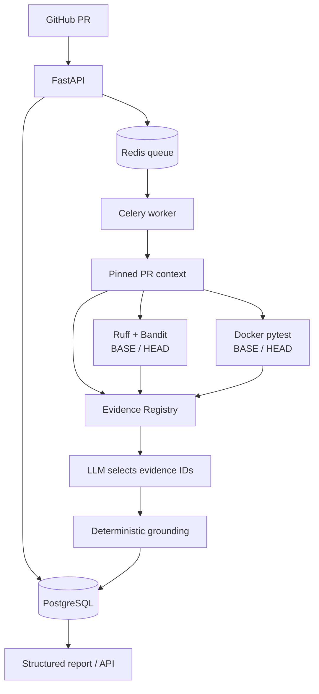

# CodeGuard

Evidence-grounded AI PR verification platform.

[](https://github.com/shuhanzhou01-stack/codeguard/actions/workflows/ci.yml) · [Architecture](ARCHITECTURE.md) · [Real-world validation](docs/REAL_WORLD_VALIDATION.md) · [Demo repository](https://github.com/shuhanzhou01-stack/codeguard-demo)

CodeGuard verifies a GitHub pull request against its pinned BASE and HEAD commits. Deterministic tools produce evidence first; a configured LLM then selects evidence IDs to explain supported findings. The platform is a review aid, not an autonomous patch generator.

## Why CodeGuard

A conventional “diff to LLM” review can invent findings, attach them to unsupported source lines, or describe a failing HEAD test as a regression without checking BASE. CodeGuard's order is **deterministic verification first, LLM reasoning second**. It runs static analysis and the same tests on both revisions, records the deltas, and resolves final report locations from a registry the model cannot edit.

## Key features

- GitHub PR ingestion with pinned BASE/HEAD SHAs and changed-file context.
- Ruff and Bandit analysis of both revisions; pytest BASE/HEAD comparison distinguishes introduced regressions from existing failures.
- Docker-isolated test execution with a read-only repository mount, disabled test network, and resource limits.
- Evidence Registry with deterministic IDs, strict structured LLM proposals, and post-model grounding.
- FastAPI control plane, PostgreSQL analysis records, Redis queue, and Celery worker.
- Ollama, OpenAI-compatible, OpenRouter, Anthropic, Gemini, and explicit fake-provider adapters.
- Read-only real-PR validation against the separate [codeguard-demo](https://github.com/shuhanzhou01-stack/codeguard-demo) repository.

## Architecture



The worker owns the Docker socket and is a trusted component; analyzed repository tests do not receive that socket. See [ARCHITECTURE.md](ARCHITECTURE.md) for trust boundaries, execution stages, and failure behavior.

## Evidence grounding

Each analysis builds a registry from observed diff hunks, static findings, and test outcomes. For example, in the controlled demo PR #2, `E003` resolves to an introduced Bandit `B602` finding at `demo_app/command_utils.py:7`. The LLM proposal selects `"evidence_ids": ["E003"]`; it cannot provide authoritative file, line, rule, or citation fields. CodeGuard rejects unknown IDs and derives report metadata from the selected entries. A BASE-pass/HEAD-fail test may remain test-level evidence when a changed source line cannot be linked reliably.

IDs are deterministic for the analysis inputs, not permanent cross-repository identifiers. A finding can cite multiple IDs; separate regressions are merged only when their common changed source hunk is unambiguous.

## Real-world validation

The two [documented validation cases](docs/REAL_WORLD_VALIDATION.md) used the real `ollama / qwen2.5-coder:7b` chain with GitHub, Docker, PostgreSQL, Redis, and Celery. Clean PR #1 produced **0 findings** and no observed false positive. Intentional failure PR #2 produced **2 findings** covering the expected security and regression categories; **2/2 were fully grounded** to resolved evidence. These are validation cases, **not a statistical benchmark**. The separate [evaluation harness](BENCHMARK.md) uses synthetic fixtures and makes no broad model-quality claim.

The [codeguard-demo](https://github.com/shuhanzhou01-stack/codeguard-demo) repository is a controlled real-PR validation environment. This repository is the CodeGuard platform itself.

## Quick start

Prerequisites: Python 3.13, Docker Desktop/Engine with Compose v2, a reachable Ollama server with `qwen2.5-coder:7b` installed, and a GitHub token with read access to the target repository. On Windows PowerShell:

```powershell
git clone https://github.com/shuhanzhou01-stack/codeguard.git
cd codeguard
Copy-Item .env.example .env
```

In the local, ignored `.env`, set a non-empty `DB_PASSWORD` and `GITHUB_TOKEN`. For the validated local-model path, set:

```dotenv
LLM_PROVIDER=ollama
LLM_MODEL=qwen2.5-coder:7b
LLM_API_BASE=http://host.docker.internal:11434/v1
```

No LLM API key is needed for local Ollama. `host.docker.internal` is the Docker Desktop host endpoint; on other Docker setups, supply a reachable host address. Do not commit `.env`. Comment publishing is disabled by default.

```powershell
docker compose up --build -d postgres redis test-runner
docker compose run --rm migrate
docker compose up -d api worker
Invoke-RestMethod http://localhost:8000/
```

The API and worker are now running. To request and read a report:

```powershell
$run = Invoke-RestMethod -Method Post http://localhost:8000/pull-requests/OWNER/REPO/NUMBER/analyze
Invoke-RestMethod "http://localhost:8000/analysis-runs/$($run.analysis_run_id)"
Invoke-RestMethod "http://localhost:8000/analysis-runs/$($run.analysis_run_id)/report"
```

The first request returns HTTP 202; poll the run until `completed` or `failed`. The full API also supports PR lookup, run history, and signed GitHub webhooks. The safe `fake` default in `.env.example` is for offline smoke tests only; it is not real-model validation.

## LLM providers

Set `LLM_PROVIDER`, `LLM_MODEL`, and the provider endpoint/key variables in `.env`. Supported providers are `ollama`, `openai`/`openai-compatible`, `openrouter`, `anthropic`, and `gemini`; `fake` is explicitly labelled and used for deterministic offline tests. Ollama needs `LLM_API_BASE` as above. Cloud providers use `OPENAI_API_KEY`, `OPENROUTER_API_KEY`, `ANTHROPIC_API_KEY`, or `GEMINI_API_KEY` (or `LLM_API_KEY` where the adapter supports it). Never put a real key in tracked configuration. Real-provider failures do not silently fall back to `fake`.

## Testing and quality

Install development dependencies in a Python 3.13 virtual environment, then run the offline core suite and production-only coverage:

```powershell
py -3.13 -m venv .venv
.\.venv\Scripts\python.exe -m pip install -r requirements-dev.txt
.\.venv\Scripts\python.exe -m pytest -q
.\.venv\Scripts\python.exe -m pytest --cov --cov-report=term-missing
.\.venv\Scripts\python.exe -m ruff check .
.\.venv\Scripts\python.exe scripts/run_bandit.py
.\.venv\Scripts\python.exe scripts/check_repo_hygiene.py
```

`.coveragerc` limits coverage to production modules; tests, migrations, demo fixtures, and caches are excluded. The locally verified **full integration** run on 2026-09-30 had **86 passed, 0 skipped, 0 failed**, **83% production coverage**, and passing Ruff/Bandit. Its PostgreSQL and Docker tests require `CODEGUARD_TEST_DATABASE_URL` and `CODEGUARD_RUN_DOCKER_TESTS=1`; without those optional services, the core CI suite skips those three integration tests. CI needs no real GitHub PAT or LLM API key. See the [validation report](docs/REAL_WORLD_VALIDATION.md) for exact environment and results.

## Security and limitations

`.env` and common secret/database artifacts are ignored by Git and Docker build context. Repository archives reject common credential files before test execution; the review prompt redacts known secret patterns before sending evidence to an external provider. These controls are defense in depth, not a guarantee against every unknown secret format. GitHub comments remain disabled unless explicitly enabled.

The real-world validation set is small. Regression-to-source-line association is conservative, and ambiguous links remain test-level rather than inventing a location. There is no production multi-tenant isolation: the trusted worker's Docker-socket access requires a controlled deployment environment. Validation of one local 7B model on two PRs does not establish performance across arbitrary repositories or models. See [ARCHITECTURE.md](ARCHITECTURE.md) and [THIRD_PARTY_NOTICES.md](THIRD_PARTY_NOTICES.md).

## License

CodeGuard's own source is licensed under [Apache-2.0](LICENSE). Dependencies keep their separate upstream licenses; in particular, Psycopg is LGPL-3.0-only.
